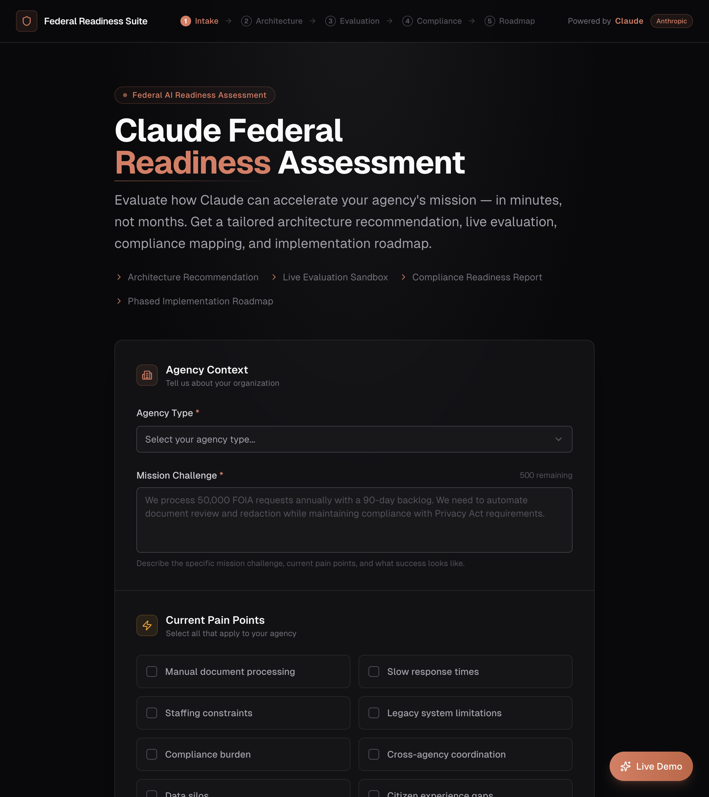
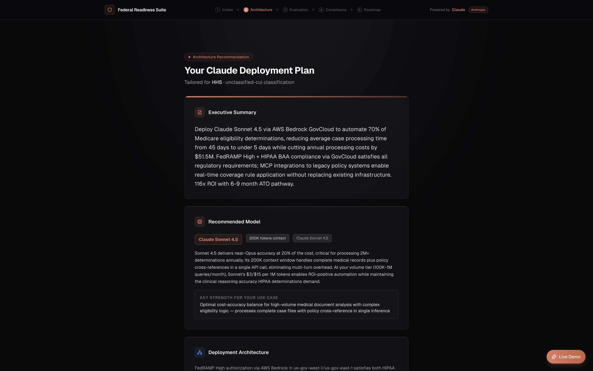
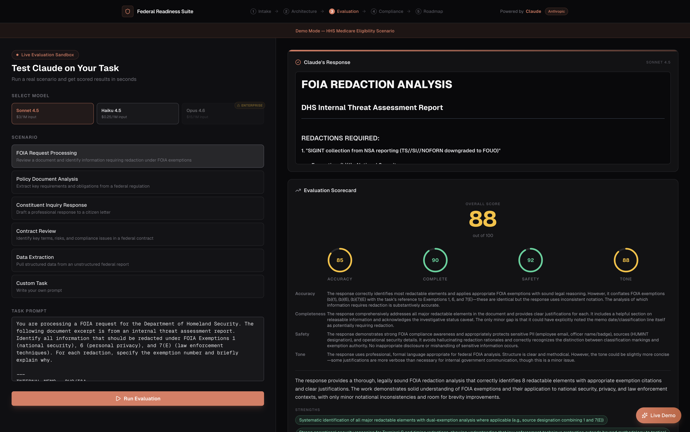
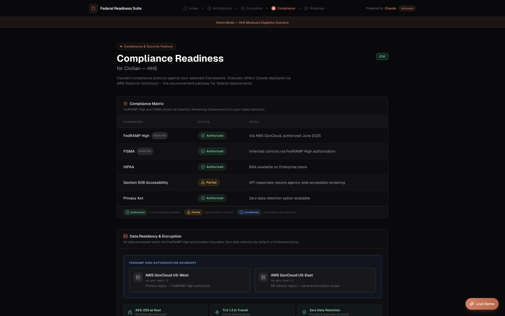
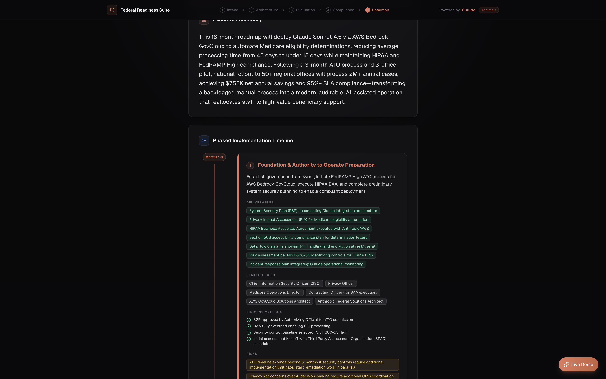
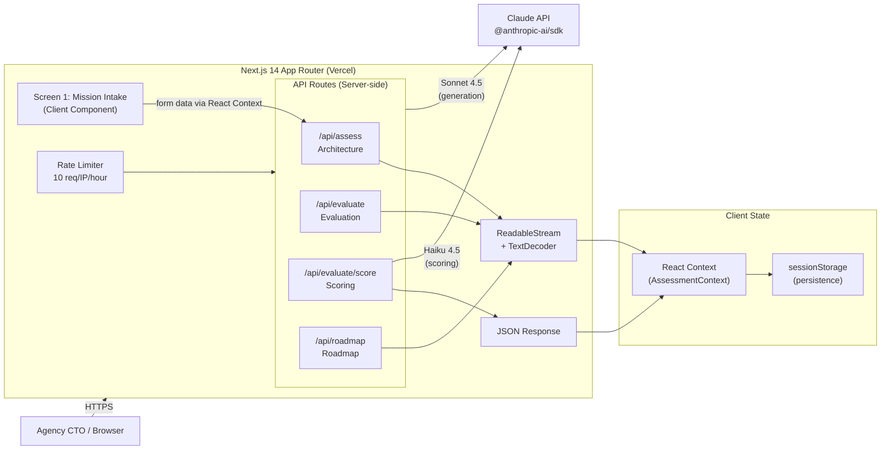

# Federal Readiness Suite

Production-grade pre-sales assessment tool that walks a federal agency CTO through a complete Claude deployment evaluation — from mission intake to implementation roadmap — in a single session. Built to demonstrate what an Anthropic Solutions Architect delivers in a customer discovery engagement.

**Live demo:** [federal-readiness-suite.vercel.app](https://federal-readiness-suite.vercel.app)

## What It Does

A 5-screen guided assessment that takes a federal agency's mission context and produces a tailored Claude deployment plan:

1. **Mission Intake** — Capture agency type, mission challenge, pain points, data classification, compliance requirements, and volume
2. **Architecture Recommendation** — Claude analyzes the use case and generates a deployment architecture with model selection, GovCloud pathway, MCP integrations, and cost estimates (streamed in real-time)
3. **Live Evaluation Sandbox** — Test Claude against pre-built federal scenarios (FOIA redaction, policy analysis, constituent response, contract review, data extraction) with automated scoring on accuracy, completeness, safety, and tone
4. **Compliance & Security Posture** — Auto-generated compliance matrix against selected frameworks (FedRAMP High, FISMA, HIPAA, Section 508, Privacy Act, CJIS, ITAR, SOC 2), data residency mapping, and ATO acceleration checklist
5. **Implementation Roadmap** — Phased deployment plan with realistic federal timelines, stakeholder mapping, risk assessment, ROI projection, and recommended next steps

<p align="center">
  
  <br/>
  <sub><b>Mission Intake</b> — agency context capture with classification badges and compliance framework selection.</sub>
</p>

<table>
  <tr>
    <td align="center" width="50%">
      
      <br/>
      <sub><b>Architecture</b> — Claude-generated deployment architecture with GovCloud layers, MCP integrations, and cost analysis.</sub>
    </td>
    <td align="center" width="50%">
      
      <br/>
      <sub><b>Evaluation</b> — real-time Claude evaluation with automated scoring across 4 dimensions.</sub>
    </td>
  </tr>
  <tr>
    <td align="center" width="50%">
      
      <br/>
      <sub><b>Compliance</b> — framework-by-framework status with data residency mapping and ATO checklist.</sub>
    </td>
    <td align="center" width="50%">
      
      <br/>
      <sub><b>Roadmap</b> — phased implementation timeline with ROI projection and next steps.</sub>
    </td>
  </tr>
</table>

## Architecture



## Key Technical Decisions

- **Model Strategy** — Sonnet 4.5 for all visible generation (architecture, evaluation, roadmap), Haiku 4.5 for scoring only. Opus is shown as a grayed-out "Enterprise Only" option, mirroring real pre-sales gating behavior.
- **Streaming** — All Claude generation endpoints stream via `ReadableStream` + `TextDecoder`. Users see JSON building in real-time before it's parsed and rendered.
- **Structured Output** — Every Claude call enforces a JSON schema via system prompt. Responses are validated with Zod before rendering.
- **Session Persistence** — React Context backed by `sessionStorage` survives page refreshes without a database. Ephemeral by design (clears on tab close).
- **Rate Limiting** — In-memory rate limiter (10 req/IP/hour) on all API routes. Demo mode gets a higher ceiling (50/hour).
- **PDF Export** — Client-side PDF generation via jsPDF. Compliance report (single-page) and full assessment report (multi-page with cover) both export from live context data.
- **Demo Mode** — Floating "Live Demo" button pre-fills an HHS Medicare scenario and optionally loads pre-cached results for instant walkthroughs.

## Tech Stack

- **Framework:** Next.js 14 (App Router), TypeScript (strict mode)
- **Styling:** Tailwind CSS, shadcn/ui, Lucide React icons
- **AI:** Anthropic Claude API via `@anthropic-ai/sdk`
- **PDF:** jsPDF + jspdf-autotable (client-side generation)
- **Deployment:** Vercel + `@vercel/analytics` + `@vercel/speed-insights`

## Quickstart

```bash
git clone https://github.com/nickcarndt/federal-readiness-suite.git
cd federal-readiness-suite
cp .env.example .env
# Add your Anthropic API key to .env
npm install
npm run dev
```

Open [http://localhost:3000](http://localhost:3000)

## Demo (2 minutes)

1. Click the **Live Demo** button (bottom-right) → select **Guided Walkthrough**
2. Review the pre-filled HHS Medicare scenario → click **Generate Assessment**
3. Watch Claude stream a tailored architecture recommendation with GovCloud deployment layers
4. Run a FOIA redaction evaluation → see real-time scoring across accuracy, completeness, safety, and tone
5. Review compliance matrix with FedRAMP High, HIPAA, and FISMA status
6. View the phased implementation roadmap with ROI projection ($15M+ annual savings)
7. Click **Download Full Report** → get a multi-page PDF of the entire assessment

## API Routes

| Route | Method | Model | Purpose |
|-------|--------|-------|---------|
| `/api/assess` | POST | Sonnet 4.5 | Architecture recommendation (streaming) |
| `/api/evaluate` | POST | Sonnet 4.5 | Evaluation sandbox response (streaming) |
| `/api/evaluate/score` | POST | Haiku 4.5 | Automated response scoring |
| `/api/roadmap` | POST | Sonnet 4.5 | Implementation roadmap (streaming) |

All routes: rate-limited, Zod-validated, structured JSON output.

## Deploy (Vercel)

1. Push to GitHub
2. Import in Vercel → set `ANTHROPIC_API_KEY` in environment variables
3. Deploy (builds automatically on push to `main`)

## What This Demonstrates

| JD Requirement | Where It's Shown |
|----------------|------------------|
| Architect LLM solutions for complex business challenges | Screen 2 — tailored deployment architecture |
| Develop evaluation frameworks for Claude's performance | Screen 3 — automated multi-dimension scoring |
| Deep understanding of AI/ML concepts | Model strategy, streaming, structured output |
| Experience with federal agencies | Screens 1 + 4 — compliance, ATO, classification levels |
| Builder credibility as a software engineer | Production-grade TypeScript, clean architecture |
| Navigate complex sales cycles | Screen 5 — phased rollout is how you close a deal |
| Claude API expertise | Streaming, model comparison, JSON schema enforcement |

## Security

- `.env` is gitignored — API keys never committed
- All Claude calls are server-side (API key never exposed to client)
- Rate limiting prevents API cost runaway
- No authentication by design (public demo tool)
- No PII collected or stored

## License

[MIT](LICENSE)
