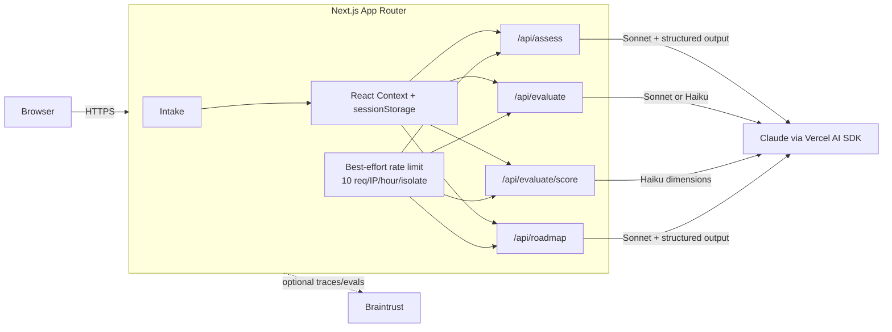

# Federal Readiness Suite

Portfolio demo: a 5-screen guided assessment that walks through a federal Claude deployment conversation — mission intake → architecture recommendation → live evaluation + scoring → compliance posture → implementation roadmap.

**This is not a production enterprise product.** It is a defensible interview artifact that uses real Claude API calls, server-side Zod validation of structured outputs, and Braintrust for tracing/evals.

**Live demo:** [federal-readiness-suite.vercel.app](https://federal-readiness-suite.vercel.app)

## What It Does

1. **Mission Intake** — Agency type, mission, pain points, classification, compliance, volume
2. **Architecture Recommendation** — Claude (Sonnet) streams a structured deployment recommendation (validated with Zod)
3. **Live Evaluation Sandbox** — Run federal scenarios; Haiku scores dimensions; overall score is computed in code
4. **Compliance & Security** — Rule/lookup matrix from intake selections (not LLM-generated)
5. **Implementation Roadmap** — Claude streams a phased plan (validated with Zod)

## Architecture


```mermaid
flowchart LR
  U[Browser] -->|HTTPS| APP

  subgraph APP["Next.js App Router"]
    INTAKE[Intake] --> CTX[React Context + sessionStorage]
    CTX --> ASSESS["/api/assess"]
    CTX --> EVAL["/api/evaluate"]
    CTX --> SCORE["/api/evaluate/score"]
    CTX --> ROADMAP["/api/roadmap"]
    RL["Best-effort rate limit\n10 req/IP/hour/isolate"] --> ASSESS
    RL --> EVAL
    RL --> SCORE
    RL --> ROADMAP
  end

  ASSESS -->|Sonnet + structured output| CLAUDE[Claude via Vercel AI SDK]
  EVAL -->|Sonnet or Haiku| CLAUDE
  SCORE -->|Haiku dimensions| CLAUDE
  ROADMAP -->|Sonnet + structured output| CLAUDE
  APP -.->|optional traces/evals| BT[Braintrust]
```

## Key Technical Decisions

- **Model tiering** — Sonnet for generation; Haiku for judge dimensions. Opus is UI-gated as “Enterprise Only” (not called).
- **Structured outputs** — Assess/roadmap/score use AI SDK `Output.object` + Zod schemas in `lib/schemas.ts`. Invalid shapes never become UI state.
- **Score math in code** — Judge returns dimension scores; `computeOverallScore` applies 40/25/25/10 weights server-side.
- **Classification refusal** — Secret / TS-SCI blocked in UI and API. Demo covers Unclassified/CUI and FOUO only.
- **Streaming** — Vercel AI SDK `streamText` / `generateText`, wrapped with Braintrust when `BRAINTRUST_API_KEY` is set. Client consumes NDJSON events (`lib/ndjson-stream.ts`).
- **Session cache** — Architecture/roadmap results persist in `sessionStorage`; remount does not silently re-call Claude.
- **Rate limiting** — In-memory, best-effort per serverless isolate (not durable cross-instance). Documented honestly.
- **Compliance screen** — Static status map tailored by intake selection — intentionally not “auto-generated by Claude.”
- **PDF export** — Client-side jsPDF from live context data.

## Tech Stack

- Next.js 14 (App Router), TypeScript (strict)
- Tailwind + shadcn/ui
- Vercel AI SDK + `@ai-sdk/anthropic`
- Zod (request + response contracts)
- Braintrust (optional tracing + eval suite)
- Vercel Analytics / Speed Insights

## Quickstart

```bash
git clone https://github.com/nickcarndt/federal-readiness-suite.git
cd federal-readiness-suite
cp .env.example .env.local
# Add ANTHROPIC_API_KEY (required for live screens)
# Optionally add BRAINTRUST_API_KEY for tracing/evals
npm install
npm run dev
```

Open [http://localhost:3000](http://localhost:3000)

Screens 2, 3, and 5 call Claude and incur API cost. Screen 4 does not.

## Demo (guided)

1. Click **Live Demo** → **Guided Walkthrough** (pre-fills HHS Medicare intake)
2. Confirm Unclassified/CUI → **Generate Assessment**
3. Review streamed architecture → continue to evaluation
4. Run a FOIA scenario → see dimension scores + deterministic overall score
5. Review compliance matrix → generate roadmap → optional PDF export

## Scripts

| Script | Purpose |
|--------|---------|
| `npm run dev` | Local Next.js |
| `npm run build` / `start` | Production |
| `npm run lint` | ESLint |
| `npm run typecheck` | `tsc --noEmit` |
| `npm test` | Unit tests (schemas, score weights, classification gate) |
| `npm run eval` | Braintrust eval suite (requires `BRAINTRUST_API_KEY` + `ANTHROPIC_API_KEY`) |

## API Routes

| Route | Method | Model | Purpose |
|-------|--------|-------|---------|
| `/api/assess` | POST | Sonnet | Architecture (NDJSON stream + Zod result) |
| `/api/evaluate` | POST | Sonnet/Haiku | Scenario response (NDJSON text + metrics) |
| `/api/evaluate/score` | POST | Haiku | Dimension scores; overall computed in code |
| `/api/roadmap` | POST | Sonnet | Roadmap (NDJSON stream + Zod result) |

## Federal capability notes

See [`docs/federal-capabilities.md`](docs/federal-capabilities.md). Prompts must stay pathway- and model-version-aware — do not overclaim FedRAMP coverage.

## What This Demonstrates (honestly)

- Multi-step LLM product UX with real streaming
- Trust-boundary validation (enums, length caps, classification refusal)
- Structured output contracts + server-side validation
- LLM-as-judge with **fixtures + deterministic rubric math** (not vibes alone)
- Optional production-style tracing via Braintrust
- Domain judgment for federal AI pre-sales conversations

## Security

- `.env*.local` gitignored — keys never committed
- Claude calls are server-side only
- Best-effort rate limiting (see above)
- No auth (public portfolio demo)
- No PII storage beyond ephemeral `sessionStorage`

## License

[MIT](LICENSE)
